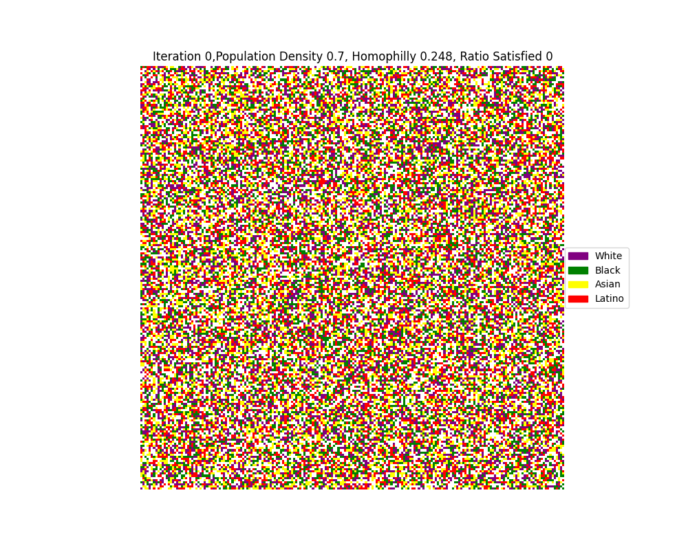
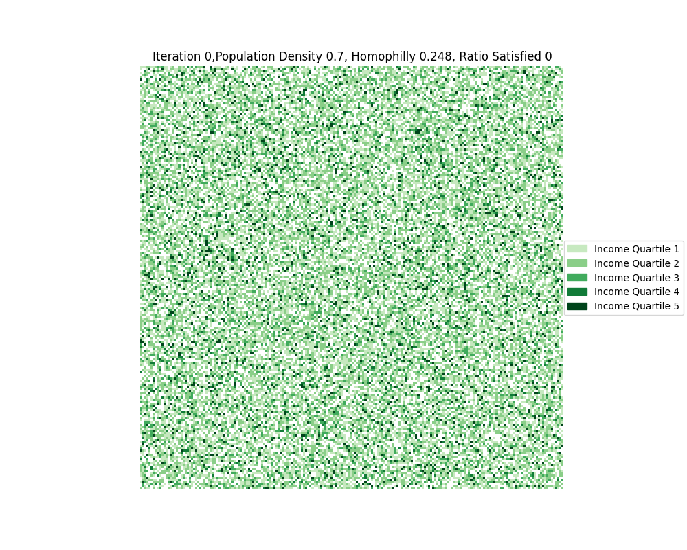

# extended-schelling-s-model
## Running the simulation:
Run main.py to run our simulation.

grid_setting.py is the file used to define plotting parameters.

model.py is our model defintion and simulation class.
## Simulation Results
The folder ./simulation_results will house the results pages in gif format.

### File naming format
There are 4 outputs from our simulation:

Content:
<ul>
  <li>Income: Income distribution </li>
  <li>Race: Race distribution </li>
  <li>Race with Schools: Race distribution with locations of schools added </li>
  <li>Time series plot of number of unsatisfied agents and global homophilly</li>
</ul>

This is the file naming format: model_content_simulation length_ simulation width_population density_income threshold_similarity threshold_time stamp(.gif or .png)

# Dataset
Income distributions based on race are found here: https://www.pewresearch.org/wp-content/uploads/sites/20/2018/07/Pew_Research_Center_Inequality-Report_FINAL.pdf 